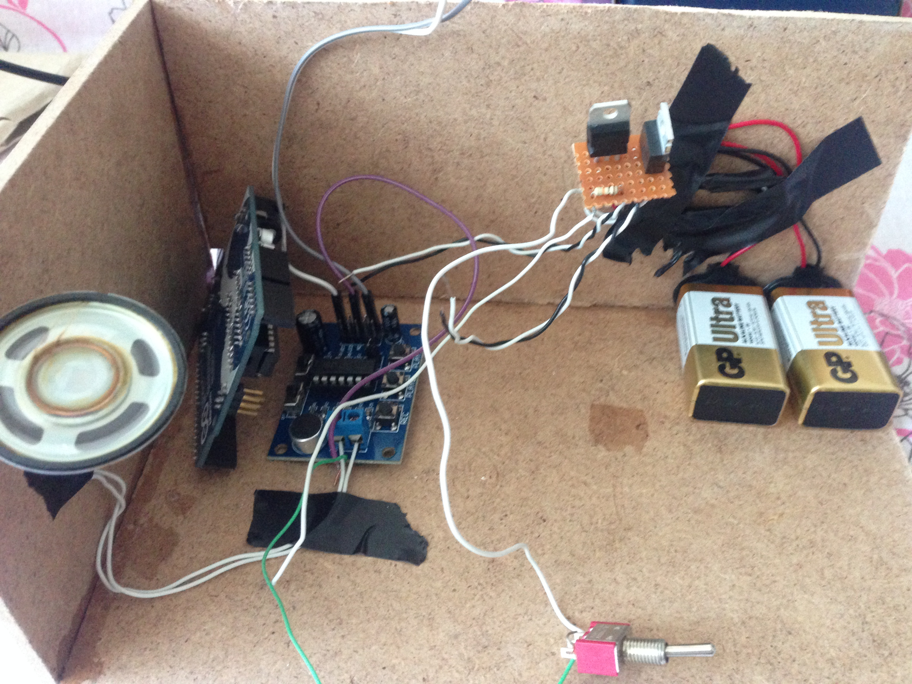
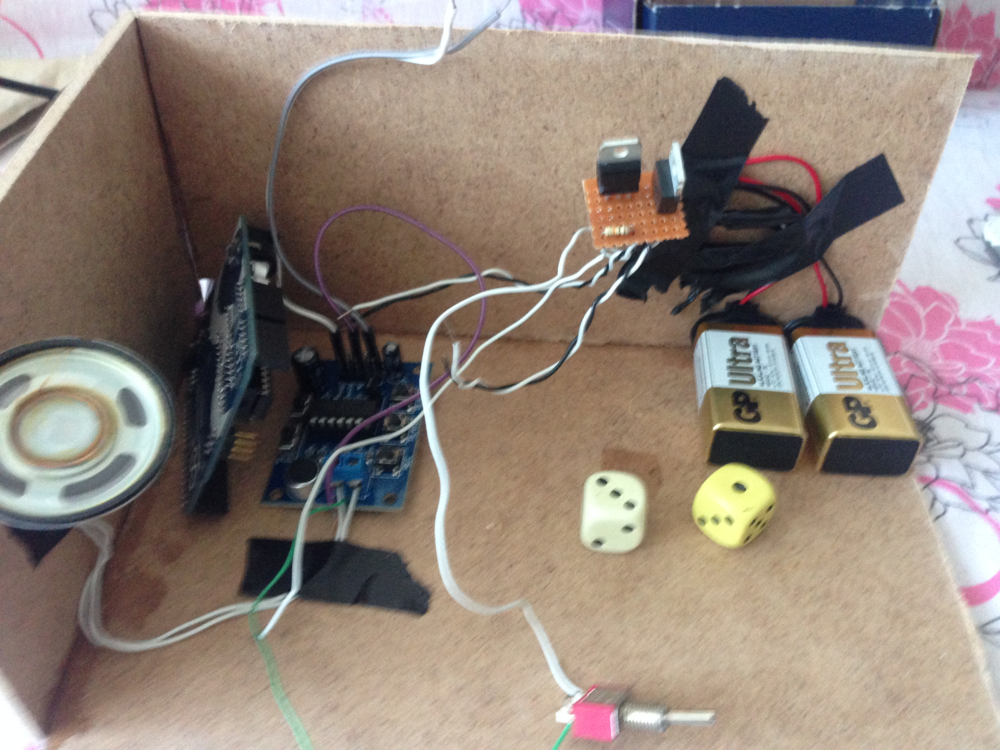

# Arduino Annoying Box (Sinir Bozucu Kutu)

Bu proje, bir anahtarı açtığınızda kutunun içinden bir kolun çıkarak anahtarı tekrar kapattığı klasik bir "Gereksiz Kutu" (Useless Box) projesidir. Ancak bu kutunun gizli bir özelliği var: **Sinir Bozucu Mod!**

---

### **✨ Proje Hakkında**

Bu kutu, standart bir "Useless Box" gibi çalışır; siz anahtarı açarsınız, o kendini kapatır. Fakat bu etkileşim 30 defa tekrarlandıktan sonra, kutu daha "akıllı" ve "sinir bozucu" davranmaya başlar. Anahtarı kapatmadan önce tereddüt eder, sahte bir geri çekilme yapar ve alaycı bir ses çalarak sizi şaşırtır.

Bu proje, 27 Ekim 2015'te bir mekatronik projesi olarak hayata geçirilmiştir.

### **🔧 Özellikler**

* **Normal Mod:** Anahtarı açtığınızda hızla kendini kapatır.
* **Sinir Bozucu Mod:** 30 kullanımdan sonra devreye giren özel bir mod.
* **Ses Efekti:** Sinir bozucu modda ISD1820 ses modülü üzerinden bir ses çalar.
* **Harici Güç Kaynağı:** Motorlar, Arduino'yu korumak için iki adet 9V pil ve 7805 voltaj regülatörleri ile harici olarak beslenmektedir.

### **🛠️ Donanım Listesi**

* 1 x Arduino (Uno modeli yeterlidir)
* 1 x 3 Ayaklı Toggle Switch
* 1 x ISD1820 Ses Kayıt ve Çalma Modülü
* 1 x 10kOhm Direnç
* 1 x 0,5W 8 Ohm Hoparlör
* 2 x Tower Pro SG90 RC Mini Servo Motor
* 2 x 7805 Voltaj Regülatörü
* 2 x 9V Pil ve Pil Başlığı
* Proje Kutusu (MDF veya karton)

**Not:** Servo motorların doğrudan Arduino üzerinden beslenmesi, Arduino kartına zarar verme riski taşıdığı için tavsiye edilmez. Bu nedenle; motorların 2 adet 9V pil ve 7805 regülatörleri ile beslenmiştir.

---

### **🔌 Devre ve Bağlantılar**

Projenin iç yapısını gösteren görseller:

 

**Temel Pin Bağlantıları (`A.Box.ino` koduna göre):**

* **Servo 1 (Kolu hareket ettiren):** Arduino Pin 9
* **Servo 2 (Kapağı açan):** Arduino Pin 10
* **Toggle Switch (Anahtar):** Arduino Pin 2
* **ISD1820 Ses Modülü (Tetikleme):** Arduino Pin 4
* **Motor Gücü:** Servo motorlar, 2 adet 9V pil ile beslenen ve 7805 regülatörleri ile 5V'a düşürülen harici bir güç kaynağına bağlıdır. Arduino ve motorların şaseleri (GND) ortaktır.

### **🚀 Kurulum ve Kullanım**

1.  Bu depodaki `A.Box.ino` dosyasını indirin.
2.  Arduino IDE'yi açın.
3.  `Servo.h` kütüphanesinin yüklü olduğundan emin olun (genellikle IDE ile birlikte gelir).
4.  Kodu Arduino kartınıza yükleyin.
5.  Devre bağlantılarını yukarıdaki şemaya göre yapın ve gücü verin.
6.  Kutunun anahtarını açarak eğlenmeye başlayın!

### **⚙️ Kodun Çalışma Mantığı**

* **`setup()`:** Servo motorlar ve pinler başlatılır. Ses modülü başlangıçta kapalı tutulur.
* **`loop()`:**
    1.  Anahtarın durumu sürekli olarak okunur (`digitalRead`).
    2.  Eğer anahtar **AÇIK (`LOW`)** konumdaysa:
        * Kapak servosu (`servo2`) kapağı açar.
        * Kol servosu (`servo1`) dışarı doğru hareket ederek anahtarı kapatır.
        * Bir sayaç (`say`) artırılır.
    3.  Eğer `say` değişkeni 30'a ulaşırsa **"Sinir Bozucu Mod"** tetiklenir:
        * Kol, geri döner gibi yapıp duraksar.
        * Ses modülü tetiklenerek kayıtlı ses oynatılır.
        * Sonunda anahtar kapatılır ve sayaç sıfırlanır.
    4.  Eğer anahtar **KAPALI (`HIGH`)** konumdaysa:
        * Kol servosu tamamen içeri çekilir.
        * Kapak servosu kutunun kapağını kapatır.

---
